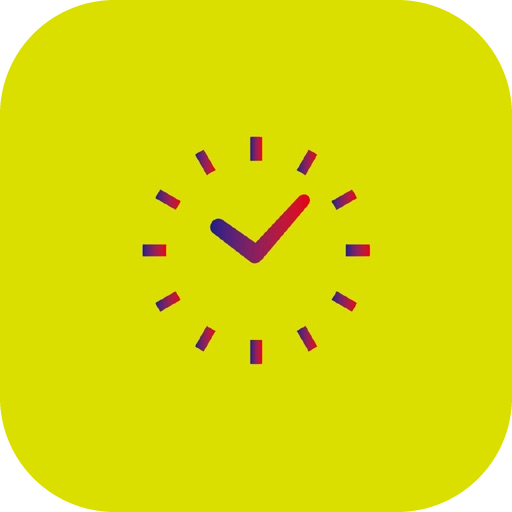

# Kyoichi Taniguchi

**iOS Engineer | Swift & SwiftUI**

English | [日本語](README.ja.md)

---

## 👨‍💻 About

- 🎓 Graduated from **Yokohama National University** (March 2025)
  - Faculty of Engineering Science — Mathematics, Physics, Electrical and Computer Engineering
- 🏢 iOS engineer at a lifestyle app company in Tokyo
- 📍 Based in Yokohama, Kanagawa, Japan
- 💡 Native iOS development with **Swift & SwiftUI**
- 🤖 Integrating AI into mobile applications

---

## 📦 Swift Packages

40+ packages are public. These are the five I use most.

| Package | Description |
|:--|:--|
| [swift-design-system](https://github.com/no-problem-dev/swift-design-system) | SwiftUI components with switchable themes |
| [swift-ui-routing](https://github.com/no-problem-dev/swift-ui-routing) | Type-safe declarative navigation for SwiftUI |
| [swift-statable](https://github.com/no-problem-dev/swift-statable) | Async loading state, handled by a single macro |
| [swift-markdown-view](https://github.com/no-problem-dev/swift-markdown-view) | Markdown editing and rendering on TextKit 2 |
| [swift-llm-client](https://github.com/no-problem-dev/swift-llm-client) | One API for Claude, GPT, Gemini and other providers |

All packages: [no-problem-dev](https://github.com/no-problem-dev)

---

## 🤖 Tools for AI-Assisted Development

Tools I built for working with coding agents.

| Tool | Description |
|:--|:--|
| [claude-gate](https://github.com/no-problem-dev/claude-gate) | Automates checking that an iOS app behaves as intended, and keeps the results as evidence |
| [claude-proto](https://github.com/no-problem-dev/claude-proto) | Builds several design proposals for one screen in parallel, to compare |

---

## 📱 Applications

| App | Description | Platform |
|:--:|:--|:--|
|  **読書メモリー** (Reading Memory) | Notes, AI conversation about a book, and reading habit tracking    | iOS |
|  **ごほうび習慣** (Gohoubi Shukan) | Habit tracking with a reward system    | iOS |

---

## 🛠 Tech Stack

### Primary

**iOS**

- **Swift** — primary language for native iOS development
- **SwiftUI** — declarative UI framework
- **UIKit** — established iOS UI framework
- **Combine** — reactive programming framework
- **async/await** — Swift structured concurrency
- **React Native** — cross-platform iOS / Android development, used on client projects

**Cloud & Backend**

- **Cloudflare** — Workers, D1, R2, Vectorize, Pages
- **Firebase** — Authentication, Firestore, Cloud Functions
- **Google Cloud Platform** — Cloud Run and related services

### Secondary

---

## 📝 Writing (Japanese)

<!-- ZENN:START -->
- [AIに「思いつき」をさせる ― 出力の多様性を設計する 8 つの工夫](https://zenn.dev/kyoichi/articles/ai-diversity-engineering-ideation)
- [動作確認の自動化で学ぶ自己進化 — AIが操作を覚えて次回より賢くなる仕組み](https://zenn.dev/kyoichi/articles/ai-qa-agent-03-self-evolution)
- [動作確認の自動化で学ぶ LLM as a Judge — 「操作するAI」と「判定するAI」を分ける理由](https://zenn.dev/kyoichi/articles/ai-qa-agent-02-llm-as-judge)
- [意図ベースでiOSアプリの動作確認を自動化する方法](https://zenn.dev/kyoichi/articles/ai-qa-agent-01-overview)
- [XcodeBuildMCP×Claude Codeスキルシステムで、iOSビルドを自動化する](https://zenn.dev/kyoichi/articles/claude-code-xcodebuildmcp-ios-build)<!-- ZENN:END -->

---

## 💬 Contact

📧 **Email:** [info@taniguchi-kyoichi.com](mailto:info@taniguchi-kyoichi.com)

🌐 **Website:** [taniguchi-kyoichi.com](https://taniguchi-kyoichi.com)
